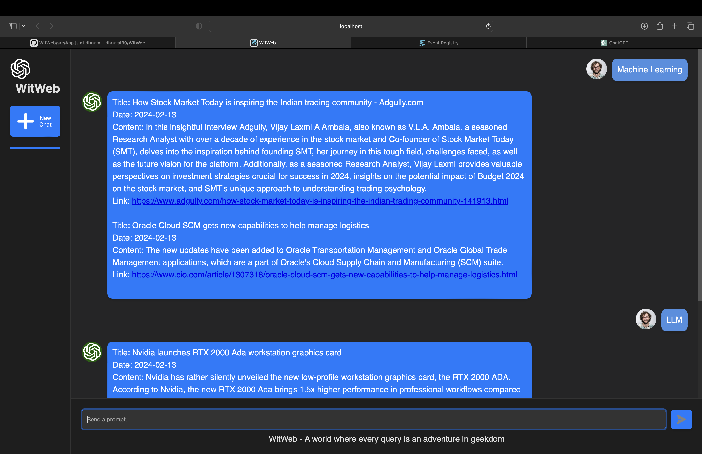

WitWeb is a tool designed to streamline the research process by helping users find relevant academic papers and recent news articles based on custom keywords.

## What It Does
Research Paper Discovery: Scrapes Google Scholar results for the given keywords and retrieves paper titles, authors, publication years, links, and sources.
News Article Fetching: Uses the Event Registry API to pull in recent news and blog articles related to the same keywords, providing both academic and real-world context.
LLM Integration: The scraped content can be used in a conversational interface with a language model, enabling users to ask questions, summarize findings, or generate insights.
 
## How It Works
Google Scholar Scraping: Utilizes requests and BeautifulSoup to parse HTML content and extract relevant metadata for research papers. Rate limiting is managed with timed delays to avoid blocking.
News Integration: The Event Registry API is queried for news/blog content, filtered for relevance and sentiment.
Keyword Input: Accepts keywords and page ranges as input, making the tool flexible for broad or narrow topic searches.
Flask API: Exposes endpoints (/get-research-papers, /get-news) for frontend integration or use with LLM-based applications.